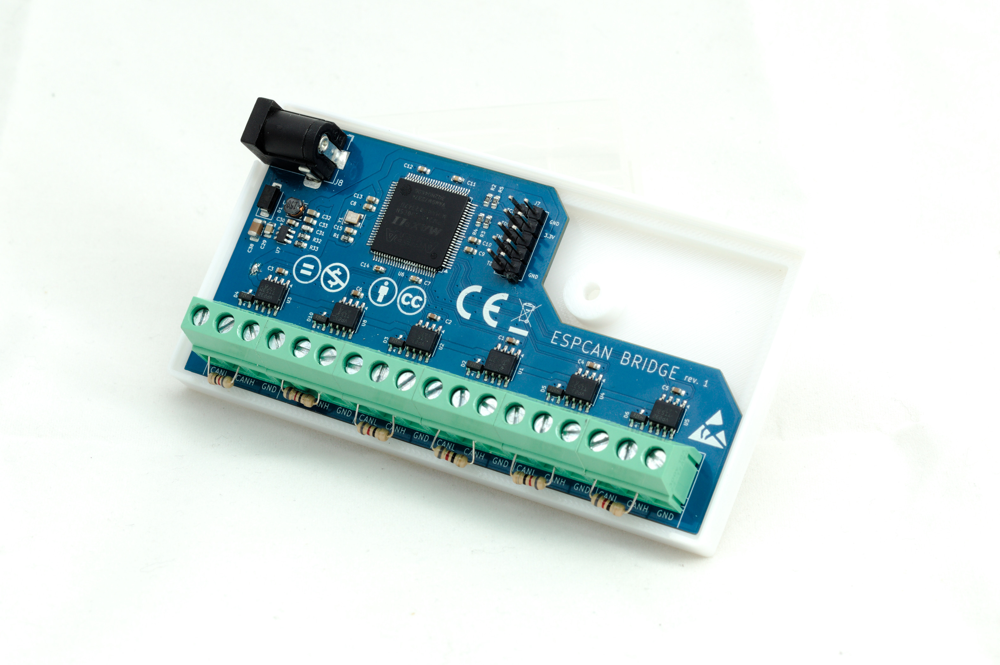

# ESPCAN-BRIDGE

A robust 6-port CAN BUS switch/bridge designed for seamless communication between multiple CAN segments.

## Overview

The **ESPCAN-BRIDGE** acts as a central hub for CAN BUS networks. Unlike simple parallel splitters, this device features an onboard **CPLD (Complex Programmable Logic Device)** that actively manages dominant bit arbitration across all 6 ports. This ensures that a dominant state on any port is correctly propagated to all others, maintaining the integrity of the CAN protocol.

## Network Topology

The **ESPCAN-BRIDGE** enhances standard CAN layouts by allowing for non-standard configurations:

* **Star Topology:** Unlike traditional CAN networks that require a linear bus structure, this device enables a **star topology**.
* **12-Branch Expansion:** By utilizing the 6 available ports as active junctions, it is possible to create a complex network with up to **12 individual branches**, significantly increasing cabling flexibility in large installations.

## Technical Specifications

* **Ports:** 6-port CAN BUS Switch.
* **Arbitration:** Hardware-level dominant bit arbitration via CPLD.
* **Operating Speed:** Fixed at **125 kbit/s**.
* **Power Supply:** 7V – 15V DC.
* **Connectors:** Screw terminals for secure industrial wiring.
* **Termination:** No internal termination resistors. 
    * *Note: 120Ω termination resistors must be added externally to the screw terminals where required by your network topology.*

## Hardware Setup

1.  **Power:** Connect a stable DC power source (7-15V) to the designated power terminals.
2.  **Wiring:** Connect your CAN high (CANH) and CAN low (CANL) wires to any of the 6 ports.
3.  **Termination:** Ensure that the two furthest ends of your overall CAN network have 120Ω resistors. Since the bridge does not have built-in resistors, you can easily bridge the terminals with a standard resistor if this device sits at a network extremity.

## License

This project is licensed under the **Creative Commons Attribution-NonCommercial-NoDerivs 4.0 International** license.

Under this license, you are free to share, copy, and redistribute the material in any medium or format, provided you follow these terms:
* **Attribution:** You must give appropriate credit.
* **Non-Commercial:** You may not use the material for commercial purposes.
* **NoDerivatives:** If you remix, transform, or build upon the material, you may not distribute the modified material.

For full details, please refer to the license links below:
* [English Version (CC BY-NC-ND 4.0)](https://creativecommons.org/licenses/by-nc-nd/4.0/deed.en)
* [Wersja Polska (CC BY-NC-ND 4.0)](https://creativecommons.org/licenses/by-nc-nd/4.0/deed.pl)

---
*Created by Wojciech Macek <wojciech.macek@gmail.com>*
